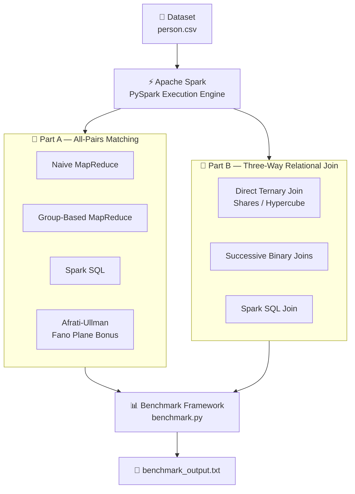

<p align="center">
  
</p>

<h1 align="center">🚀 Distributed Data Processing with Apache Spark</h1>

<p align="center">
  MSc Data & Web Science • Aristotle University of Thessaloniki
</p>


**MSc Data & Web Science — Distributed Data Processing 2025-2026**  
**Aristotle University of Thessaloniki**

👨‍💻 **Contributors**

- Georgios Varatis (AM: 219)
- Evangelia Girousi (AM: 229)

---

## 📖 Project Overview

This project implements and benchmarks distributed data processing algorithms using **Apache Spark (PySpark)**.

The project is divided into two parts:

### 🔹 Part A — All-Pairs Matching

Enumerate every unique unordered pair from a set of **N elements** using:

- 🧩 Naive MapReduce
- 📦 Group-Based MapReduce
- ⚡ Spark SQL
- 🏆 Afrati-Ullman / Fano Plane Optimal Design

### 🔹 Part B — Three-Way Relational Join

Compute:

```text
A(x,y) ⋈ B(y,z) ⋈ C(z,w)
```

using:

- 🔺 Direct Ternary Join (Shares / Hypercube)
- 🔗 Two Successive Binary Joins
- ⚡ Spark SQL Join

---

## 🏗️ Project Architecture


---

## 🛠️ Prerequisites

| 📦 Dependency | 🔢 Version |
|--------------|------------|
| Java JDK | 11.0.0.2 |
| Apache Spark | 3.5.8 |
| Hadoop winutils (Windows only) | 3.x |
| Python | 3.11.0 |

### Install Dependencies

```bash
python -m venv .venv
.venv\Scripts\pip install -r requirements.txt
```

---

## 📂 Project Structure

```text
Spark_Project/
├── config.py                  # Central configuration and data-loader factory
├── requirements.txt           # Python dependencies
├── Dataset/
│   └── person.csv             # Source dataset (up to 1M rows)
└── src/
    ├── benchmark.py           # Full benchmark matrix (Part A + Part B, single Spark session)
    ├── partA/
    │   ├── naive.py           # Naive MapReduce — one reducer per pair
    │   ├── group.py           # Group-Based MapReduce — G=10 bucket groups
    │   ├── sql.py             # Spark SQL with Catalyst optimizer (BROADCAST hint)
    │   └── partA_bonus.py     # Bonus — Afrati-Ullman / Fano Plane optimal design
    └── partB/
        ├── ternary.py         # Direct Ternary Join (Hypercube / Shares, K×K grid)
        ├── binary.py          # Two Successive Binary Joins (two-round hash join)
        └── join_sql.py        # Spark SQL three-way join (Catalyst SortMergeJoin)
```

---

## ⚙️ Configuration

All runtime parameters live in `config.py`. Edit this file to change dataset size, group count, hypercube side length, or benchmark matrices — no changes to the algorithmic scripts are needed.

| Variable | Default | Description |
|---|---|---|
| 🧪 `TEST_MODE` | `False` | `True` uses a synthetic integer RDD (fast debugging); `False` loads `person.csv` |
| 📊 `LIMIT_N` | `500` | Rows loaded from `person.csv` for individual Part A scripts |
| 📦 `G` | `10` | Number of groups for the group-based approach (yields 55 reducers) |
| 🔗 `PART_B_N` | `200` | Tuples per relation for individual Part B scripts |
| 🎯 `PART_B_D` | `30` | Join-attribute domain size for individual Part B scripts |
| 🧊 `PART_B_K` | `10` | Hypercube side length (K² reducers) |
| 📈 `BENCH_A_SIZES` | `[500,1000,2000,5000]` | N values for the Part A benchmark matrix |
| 📉 `BENCH_B_SELECTIVITY` | see config | (N, D) pairs for the selectivity sweep |
| 📏 `BENCH_B_SCALE` | see config | (N, D) pairs for the scale sweep |

---
